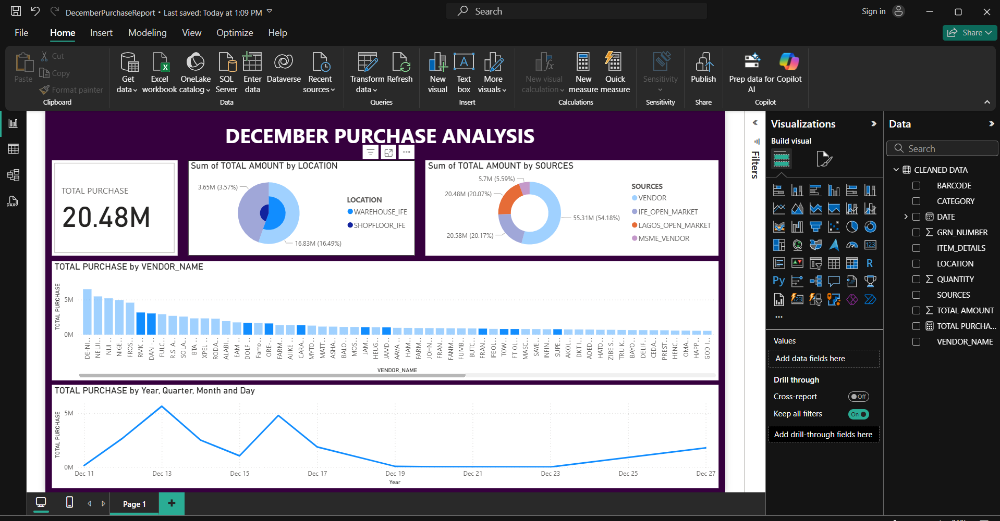

# December Purchase Analytics – Power BI Dashboard

## Objective
Provide insights into vendor performance and product category spending in December.

## Tools Used
- Power BI
- DAX
- Data Cleaning and Modeling

## Key Insights
- Identified top-performing suppliers based on volume and cost.
- Analyzed daily expenditure trends.
- Visual layout designed for quick procurement decisions.

## Dashboard Preview

