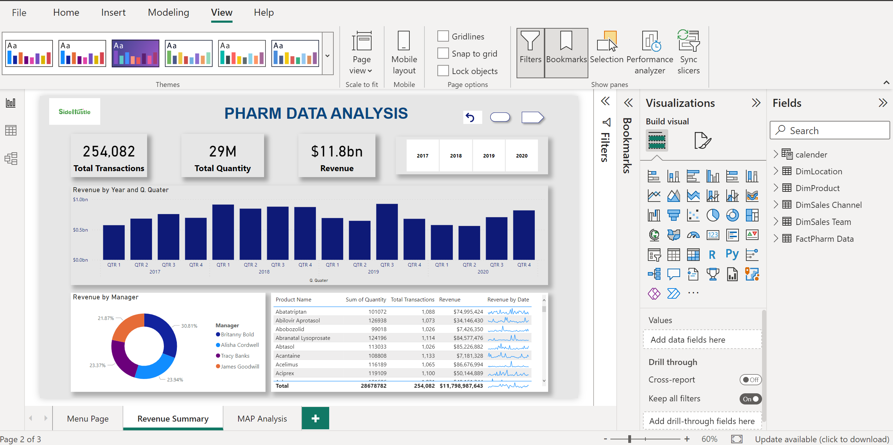

# Pharm Data Analysis – Power BI Dashboard

## Objective
Analyze pharmaceutical sales data from 2017 to 2020 and uncover insights across transactions, quantity, and revenue.

## Tools Used
- Power BI
- DAX
- Data Modeling

## Key Insights
- Total revenue: $11.8B
- Total quantity sold: 29 million units
- Most revenue generated in Q3 2019
- Brittany Bold led with 30.8% of revenue contribution

## Dashboard Preview

## Files
- PharmDataDashboard.pbix
